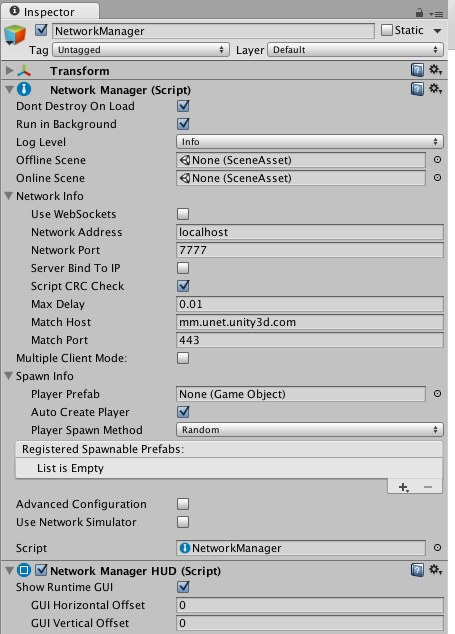
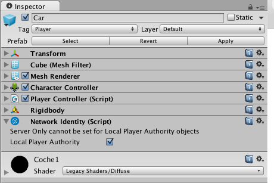
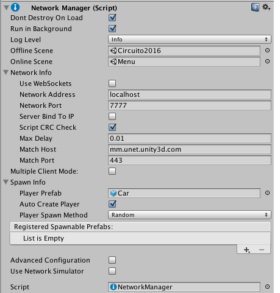
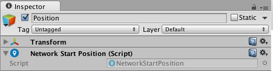
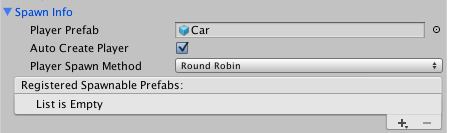

# Diseño de Redes en Unity

## Introducción:

En esta práctica veremos como usar las herramientas que nos proporciona Unity para hacer un juego en red. El juego que usaremos será un juego de coches en 2-D.

En este repositorio tenemos el código del que partiremos para hacer que el juego sea multijugador, además al controlador del juego se le ha eliminado toda la física.

A continuación, veremos un breve resumen de los pasos que vamos a realizar en esta práctica:

* Completar la física del coche que se usará en el juego.
* Añadir componentes de Red de Unity.
* Crear la parrilla de salida de los coches.

Comenzemos con la práctica.

## Paso 1: Completar el Prefab `Car`.

En primer lugar vamos a completar la funcionalidad del coche que se utilizará en el juego. El coche tiene asignado el script `PlayerController.cs` para implementar toda la parte que controla el coche. En este momento el script tiene el siguiente código:

```C#
/// <summary>
/// Clase que controla las acciones del jugador y las
/// representa en el juego.
/// </summary>
public class PlayerController : MonoBehaviour {
    
    // Constantes del comportamiento del coche
    public float _acel = 4;
    public float _drag = 1;
    public float _brakeAcel = 12;
    public float _maxVelocity = 10;
    
    // Controlador del movimiento
    private CharacterController _controller;
        
    // Velocidad del jugador
    Vector3 velocity;
    
    public Vector3 Velocity {
        get {return velocity;}
    }
    
    // Registro de los input del jugador
    float _vInput = 0;
    float _hInput = 0;
}
```

El controlador tiene distintos atributos que necesitaremos a la hora de controlar el vehículo. En primer lugar tenemos las constantes del comportamiento del coche que son:

* `_acel`: Constante de aceleración del coche.
* `_drag`: Constante de decelarición del coche cuando no se actua sobre el, es decir, la inercia.
* `_brakeAcel`: Constante de deceleración del coche cuando el jugador frena.
* `_maxVelocity`: Velocidad máxima permitida.

Además tenemos un atributo para poder modificar el controlador de moviemiento (`_controller`), la velocidad del jugador `velocity` y un registro de los controles del usuario: `_vInput` para controlar el eje vertical y `_hInput` para controlar el eje horizontal.

En primer lugar vamos a crear unas funciones que calculen la aceleración y la velocidad en ese momento y otra función que mueva al jugador usando el controlador:

```C#
/// <summary>
/// Método que devuelve la aceleración actual del coche a partir
/// de la acelaración anterior y el input.
/// </summary>
/// <returns></returns>
Vector3 CalculateAceleration () {        
    Vector3 acel;
    
    if (_vInput > 0) {
        acel = transform.forward * _vInput * _acel;
    } else if (_vInput == 0) {
        acel = transform.forward * -_drag;
    } else {
        acel = transform.forward * _vInput * _brakeAcel;
    }
            
    acel += transform.right * _hInput * velocity.magnitude;
    
    return acel;
}

/// <summary>
/// Método que calcula la velocidad actual del vehículo a partir
/// del la velocidad anterior y la aceleración que se pasa por parámetro.
/// </summary>
/// <param name="acel"></param>
void CalculateVelocity (Vector3 acel) {
    velocity += acel * Time.fixedDeltaTime;
    
    if (velocity.magnitude > _maxVelocity) {
        velocity *= _maxVelocity / velocity.magnitude;
    } else if (velocity != Vector3.zero && Vector3.Angle (velocity, transform.forward) > 90) {
        velocity = Vector3.zero;
    }
}
   
/// <summary>
/// Método que se encarga del movimiento del jugador.
/// </summary>
void MovePlayer () {
    Vector3 motion = velocity * Time.fixedDeltaTime;
    
    _controller.Move (motion);
    
    if (velocity != Vector3.zero) {
        transform.rotation = Quaternion.LookRotation (velocity);
    }
}
```

Cada vez que actualicemos la escena debemos capturar el Input del usuario y ejecutar estas 3 acciones en el orden en el que se han creado. Crearemos una función `Update ()` que realizará estas acciones:

```C#
void Update () {        
    // Capturamos el input del jugador
    float vInput = Input.GetAxisRaw ("Vertical");
    if (_vInput != vInput) {
        _vInput = vInput;
    }
    
    float hInput = Input.GetAxisRaw ("Horizontal");
    if (_hInput != hInput) {
        _hInput = hInput;
    }   
    
    // Movemos el coche
    Vector3 acel = CalculateAceleration ();
    CalculateVelocity (acel);
    MovePlayer ();
}
```

Por último, para poder mover el coche tenemos que capturar el `CharacterController`, por lo que en el método `Start ()` lo capturamos:

```C#
void Start () {
    _controller = GetComponent<CharacterController> ();
}
```

Si añadimos un coche a la escena y ejecutamos el juego podemos ver como hemos conseguido gestionar el movimiento del coche. El problema es que queremos que la camara se centre en la posición del jugador y no que muestre la escena completa. Existe un `CameraController.cs` que tiene una función pública `AddTarget ()`, que nos permite asignarle un objetivo que seguir.

En el método `Start ()` insertamos las instrucciones para que el *Main Camera* siga al jugador:

```C#
void Start () {
    _controller = GetComponent<CharacterController> ();
    
    CameraController cameraCont= GameObject.Find ("Main Camera").GetComponent<CameraController> ();
    cameraCont.AddTarget (gameObject);
}
```

En este punto ya tenemos el juego preparado para partidas monojugador. Vamos a añadir los elementos para hacerlo multijugador.

## Paso 2: Añadir componentes de Red de Unity (HLAPI).

Unity tiene diversos componentes que nos simplifican la creación de un juego en red. En esta práctica usaremos la API de alto nivel de Unity (HLAPI) de su arquitectura de red. Todos estos componentes se encuentran dentro de la carpeta `Network` de los componentes.

En primer lugar vamos a crear un controlador de red. En este controlador incluiremos el manager de Unity y la interfaz gráfica básica del juego de red. Para ello creamos un objeto vacio en la escena y le llamamos `NetworkManager`. A dicho objeto le añadimos 2 componentes de red: `Network Manager` que será el encargado de las conexiones y el `Network Manager HUD` que nos dará una interfaz gráfica de red. El GameObject nos quedará así:



Este NetworkManager nos va a permitir crear partidas online del tipo *Cliente-Servidor*, que es el tipo de arquitectura de red que vamos a usar en nuestro juego.

En primer lugar, tenemos que indicar al `NetworkManager` que elemento representa a los jugadores. En este caso, los jugadores será una representación del prefab `Car`. Antes de añadir dicho prefab al campo *PlayerPrefab* de *Spawn Info*, debemos darle un identificador de red a dicho Prefab.

Nos vamos al prefab `Car` y le añadimos un nuevo componente. En este caso será el `Network Identity`. Al añadir dicho componente, nuestro elemento tendrá un identificador de red cuando se ejecute el juego. Como va a ser el elemento que usarán los jugadores, seleccionamos la opción *Local Player Authority*. Esto hará que los jugadores puedan controlar este elemento localmente. El inspector del prefab quedará de la suiguiente manera:



Con nuestro prefab preparado para ser identificado en la red y ser controlado por los jugadores locales, lo arrastramos hasta la opción *Player Prefab* del `Network Manager`. Además, el `Network Manager` nos permite crear 2 escenas, una `offline` y otra `online`. La primera se muestra cuando el jugador no ha entrado en el juego y la segunda ya es el juego en red. En este caso vamos a asignar la escena **Menu** como *offline* y la escena **Circuito 2016** como *online*. Nuestro `Network Manager` quedará así:



Como la idea es que el Menú sea lo primero que se muestre, movemos el `Network Manager` object a la escena del Menú, y esá será nuestra escena principal.

Si ejecutamos el juego en este momento vemos que tenemos varios problemas: 
* Nuestro coche no está situado en la salida, sino que lo muestra en el centro del circuito. 
* Si ejecutamos otra ejecución del juego y nos conectamos como clientes, vemos que no podemos ver la representación del otro coche.
* No se muestran los movimientos que hacemos desde el otro lado de la conexión.

Vamos a ir resolviendo estos errores.

## Paso 3: Parrilla de Salida

El primer error que debemos corregir es la colocación inicial del coche. El `Network Manager` desconoce que estamos hacien un juego de carreras y como debe colocar las representaciones de los jugadores. Por eso crearemos una parrilla de salida donde le marcaremos al `Network Manager` donde deben de empezar los jugadores.

Vamos a la escena **Circuito 2016** y creamos un `Game Object` vacio. Le llamamos *Parrilla*. Esta parrilla contendrá todas las posiciones de salida de los coches. Movemos dicho objeto a la linea de meta. Dentro de la parrilla creamos otro `Game Object` vacío llamado *Position*. Este será la ubicación que ocupara un jugador. Para decirselo al `Network Manager` debemos añadir un componente de red a dicho objeto: `Network Start Position`.



Guardamos la escena y lo ejecutamos nuevamente (desde la escena **Menu**, acuerdate). ¡Bien! Ahora ya nos coloca el coche en su sitio. Ahora si ejecutamos un Build de la aplicación y nos conectamos como clientes... ¿Qué pasa?, nos está colocando en la misma posición :-S.

Vale, tendremos que dublicar el objecto *Position* y colocarlos como si fuera una parrilla de salida. Copiamos el objeto *Position*, lo copiamos 5 veces (por ejemplo) y colocamos cada posición de forma que tengamos una parrilla.

Muy bien, esto ahora debería de funcionar. Volvemos a ejecutar desde el propio Unity y un build que se conecte como cliente. Y vemos que tenemos un problema... nos coloca los coches en posiciones aleatorias y no respetando el orden de conexión, o como podemos llamarlo la *Pole position*. El problema está al generar los jugadores. Si vamos al `Network Manager` y vemos cómo se generan los jugadores vemos que *Player Spawn Method* pone *Random*, por lo que hará que ponga a los jugadores en posiciones aleatorias. Lo que haremos será cambiar el modo a *Round Robin*.



