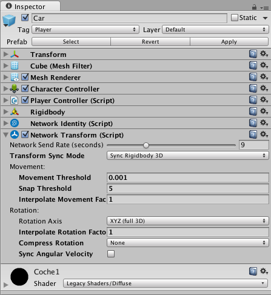

# Diseño de Redes en Unity

## Día 1: Aplicando los Componentes de Red de Unity

### Introducción:

En esta práctica veremos como usar las herramientas que nos proporciona Unity para hacer un juego en red. El juego que usaremos será un juego de coches en 2-D.

En este repositorio tenemos el código del que partiremos para hacer que el juego sea multijugador, además al controlador del juego se le ha eliminado toda la física.

A continuación, veremos un breve resumen de los pasos que vamos a realizar en esta práctica:

* Completar la física del coche que se usará en el juego.
* Añadir componentes de Red de Unity.
* Crear la parrilla de salida de los coches.
* Limitar control sólo a la representación del jugador local.
* Sincronizar movimientos para que se vean en los otros clientes.

Comenzemos con la práctica.

### Paso 1: Completar el Prefab `Car`.

En primer lugar vamos a completar la funcionalidad del coche que se utilizará en el juego. El coche tiene asignado el script `PlayerController.cs` para implementar toda la parte que controla el coche. En este momento el script tiene el siguiente código:

```C#
/// <summary>
/// Clase que controla las acciones del jugador y las
/// representa en el juego.
/// </summary>
public class PlayerController : MonoBehaviour {
    
    // Constantes del comportamiento del coche
    public float _acel = 4;
    public float _drag = 1;
    public float _brakeAcel = 12;
    public float _maxVelocity = 10;
    
    // Controlador del movimiento
    private CharacterController _controller;
        
    // Velocidad del jugador
    Vector3 velocity;
    
    public Vector3 Velocity {
        get {return velocity;}
    }
    
    // Registro de los input del jugador
    float _vInput = 0;
    float _hInput = 0;
}
```

El controlador tiene distintos atributos que necesitaremos a la hora de controlar el vehículo. En primer lugar tenemos las constantes del comportamiento del coche que son:

* `_acel`: Constante de aceleración del coche.
* `_drag`: Constante de decelarición del coche cuando no se actua sobre el, es decir, la inercia.
* `_brakeAcel`: Constante de deceleración del coche cuando el jugador frena.
* `_maxVelocity`: Velocidad máxima permitida.

Además tenemos un atributo para poder modificar el controlador de moviemiento (`_controller`), la velocidad del jugador `velocity` y un registro de los controles del usuario: `_vInput` para controlar el eje vertical y `_hInput` para controlar el eje horizontal.

En primer lugar vamos a crear unas funciones que calculen la aceleración y la velocidad en ese momento y otra función que mueva al jugador usando el controlador:

```C#
/// <summary>
/// Método que devuelve la aceleración actual del coche a partir
/// de la acelaración anterior y el input.
/// </summary>
/// <returns></returns>
Vector3 CalculateAceleration () {        
    Vector3 acel;
    
    if (_vInput > 0) {
        acel = transform.forward * _vInput * _acel;
    } else if (_vInput == 0) {
        acel = transform.forward * -_drag;
    } else {
        acel = transform.forward * _vInput * _brakeAcel;
    }
            
    acel += transform.right * _hInput * velocity.magnitude;
    
    return acel;
}

/// <summary>
/// Método que calcula la velocidad actual del vehículo a partir
/// del la velocidad anterior y la aceleración que se pasa por parámetro.
/// </summary>
/// <param name="acel"></param>
void CalculateVelocity (Vector3 acel) {
    velocity += acel * Time.fixedDeltaTime;
    
    if (velocity.magnitude > _maxVelocity) {
        velocity *= _maxVelocity / velocity.magnitude;
    } else if (velocity != Vector3.zero && Vector3.Angle (velocity, transform.forward) > 90) {
        velocity = Vector3.zero;
    }
}
   
/// <summary>
/// Método que se encarga del movimiento del jugador.
/// </summary>
void MovePlayer () {
    Vector3 motion = velocity * Time.fixedDeltaTime;
    
    _controller.Move (motion);
    
    if (velocity != Vector3.zero) {
        transform.rotation = Quaternion.LookRotation (velocity);
    }
}
```

Cada vez que actualicemos la escena debemos capturar el Input del usuario y ejecutar estas 3 acciones en el orden en el que se han creado. Crearemos una función `Update ()` que realizará estas acciones:

```C#
void Update () {        
    // Capturamos el input del jugador
    float vInput = Input.GetAxisRaw ("Vertical");
    if (_vInput != vInput) {
        _vInput = vInput;
    }
    
    float hInput = Input.GetAxisRaw ("Horizontal");
    if (_hInput != hInput) {
        _hInput = hInput;
    }   
    
    // Movemos el coche
    Vector3 acel = CalculateAceleration ();
    CalculateVelocity (acel);
    MovePlayer ();
}
```

Por último, para poder mover el coche tenemos que capturar el `CharacterController`, por lo que en el método `Start ()` lo capturamos:

```C#
void Start () {
    _controller = GetComponent<CharacterController> ();
}
```

Si añadimos un coche a la escena y ejecutamos el juego podemos ver como hemos conseguido gestionar el movimiento del coche. El problema es que queremos que la camara se centre en la posición del jugador y no que muestre la escena completa. Existe un `CameraController.cs` que tiene una función pública `AddTarget ()`, que nos permite asignarle un objetivo que seguir.

En el método `Start ()` insertamos las instrucciones para que el *Main Camera* siga al jugador:

```C#
void Start () {
    _controller = GetComponent<CharacterController> ();
    
    CameraController cameraCont= GameObject.Find ("Main Camera").GetComponent<CameraController> ();
    cameraCont.AddTarget (gameObject);
}
```

En este punto ya tenemos el juego preparado para partidas monojugador. Vamos a añadir los elementos para hacerlo multijugador.

### Paso 2: Añadir componentes de Red de Unity (HLAPI).

Unity tiene diversos componentes que nos simplifican la creación de un juego en red. En esta práctica usaremos la API de alto nivel de Unity (HLAPI) de su arquitectura de red. Todos estos componentes se encuentran dentro de la carpeta `Network` de los componentes.

En primer lugar vamos a crear un controlador de red. En este controlador incluiremos el manager de Unity y la interfaz gráfica básica del juego de red. Para ello creamos un objeto vacio en la escena y le llamamos `NetworkManager`. A dicho objeto le añadimos 2 componentes de red: `Network Manager` que será el encargado de las conexiones y el `Network Manager HUD` que nos dará una interfaz gráfica de red. El GameObject nos quedará así:


Este NetworkManager nos va a permitir crear partidas online del tipo *Cliente-Servidor*, que es el tipo de arquitectura de red que vamos a usar en nuestro juego.

En primer lugar, tenemos que indicar al `NetworkManager` que elemento representa a los jugadores. En este caso, los jugadores será una representación del prefab `Car`. Antes de añadir dicho prefab al campo *PlayerPrefab* de *Spawn Info*, debemos darle un identificador de red a dicho Prefab.

Nos vamos al prefab `Car` y le añadimos un nuevo componente. En este caso será el `Network Identity`. Al añadir dicho componente, nuestro elemento tendrá un identificador de red cuando se ejecute el juego. Como va a ser el elemento que usarán los jugadores, seleccionamos la opción *Local Player Authority*. Esto hará que los jugadores puedan controlar este elemento localmente. El inspector del prefab quedará de la suiguiente manera:


Con nuestro prefab preparado para ser identificado en la red y ser controlado por los jugadores locales, lo arrastramos hasta la opción *Player Prefab* del `Network Manager`. Además, el `Network Manager` nos permite crear 2 escenas, una `offline` y otra `online`. La primera se muestra cuando el jugador no ha entrado en el juego y la segunda ya es el juego en red. En este caso vamos a asignar la escena **Menu** como *offline* y la escena **Circuito 2016** como *online*. Nuestro `Network Manager` quedará así:


Como la idea es que el Menú sea lo primero que se muestre, movemos el `Network Manager` object a la escena del Menú, y esá será nuestra escena principal.

Si ejecutamos el juego en este momento vemos que tenemos varios problemas: 
* Nuestro coche no está situado en la salida, sino que lo muestra en el centro del circuito. 
* Si ejecutamos otra ejecución del juego y nos conectamos como clientes, vemos que no podemos ver la representación del otro coche.
* No se muestran los movimientos que hacemos desde el otro lado de la conexión.

Vamos a ir resolviendo estos errores.

### Paso 3: Parrilla de Salida

El primer error que debemos corregir es la colocación inicial del coche. El `Network Manager` desconoce que estamos hacien un juego de carreras y como debe colocar las representaciones de los jugadores. Por eso crearemos una parrilla de salida donde le marcaremos al `Network Manager` donde deben de empezar los jugadores.

Vamos a la escena **Circuito 2016** y creamos un `Game Object` vacio. Le llamamos *Parrilla*. Esta parrilla contendrá todas las posiciones de salida de los coches. Movemos dicho objeto a la linea de meta. Dentro de la parrilla creamos otro `Game Object` vacío llamado *Position*. Este será la ubicación que ocupara un jugador. Para decirselo al `Network Manager` debemos añadir un componente de red a dicho objeto: `Network Start Position`.


Guardamos la escena y lo ejecutamos nuevamente (desde la escena **Menu**, acuerdate). ¡Bien! Ahora ya nos coloca el coche en su sitio. Ahora si ejecutamos un Build de la aplicación y nos conectamos como clientes... ¿Qué pasa?, nos está colocando en la misma posición :-S.

Vale, tendremos que dublicar el objecto *Position* y colocarlos como si fuera una parrilla de salida. Copiamos el objeto *Position*, lo copiamos 5 veces (por ejemplo) y colocamos cada posición de forma que tengamos una parrilla.

Muy bien, esto ahora debería de funcionar. Volvemos a ejecutar desde el propio Unity y un build que se conecte como cliente. Y vemos que tenemos un problema... nos coloca los coches en posiciones aleatorias y no respetando el orden de conexión, o como podemos llamarlo la *Pole position*. El problema está al generar los jugadores. Si vamos al `Network Manager` y vemos cómo se generan los jugadores vemos que *Player Spawn Method* pone *Random*, por lo que hará que ponga a los jugadores en posiciones aleatorias. Lo que haremos será cambiar el modo a *Round Robin*.


Esto hace que ya tengamos a los jugadores en distintas posiciones. Ahora cuando jugamos en cualquiera de las 2 ventanas vemos que controlamos a ambos coches. Hay que decirle al `PlayerContoller` que solo nos mueva sí somos el jugador local (`isLocalPlayer`). Para ello debemos hacer varios cambios en el `PlayerController.cs

## Paso 4: Modificar el controlador del jugador.

Como hemos visto, cuando movemos el coche en nuestra partida también movemos el del otro jugador. El problema es que no estamos limitando nuestros movimientos a nuestro jugador local. Para ello, vamos a `PlayerController.cs` y hacemos unos pequeños cambios para que solo controlesmos el jugador local.

En primer lugar, tenemos que hacer que este script deje de heredar de `MonoBehaviour` para que herede de `NetworkBehaviour`. El `NetworkBehaviour` es equivalente a `MonoBehaviour` pero al que se le han añadido atributos y funciones de red. Modificamos la clase para que herede de la nueva clase:

```C#
using UnityEngine.Networking;

public class Player_Controller : NetworkBehaviour {
    ...
}
```

Ahora ya podemos llamar a funciones de red para saber si somos el jugador local. Lo que queremos es que se modifique nuestra posición solo si somos el jugador local. Para ello, nos vamos a la función `Update ()` y lo condicionamos a que sea el jugador local llamando al atributo boolean `isLocalPlayer`:

```C#
void Update () {        
        
    if (isLocalPlayer) {
        // Capturamos el input del jugador
        float vInput = Input.GetAxisRaw ("Vertical");
        if (_vInput != vInput) {
            _vInput = vInput;
        }

        float hInput = Input.GetAxisRaw ("Horizontal");
        if (_hInput != hInput) {
            _hInput = hInput;
        }   

        // Movemos el coche
        Vector3 acel = CalculateAceleration ();
        CalculateVelocity (acel);
        MovePlayer ();
    }
}
```
Además, tenemos que decirle a la cámara que tiene que seguir a nuestro jugador local. En la función `Start ()` condicionamos el target de nuestra cámara y la asignación de nuestro controlador se haga únicamente cuando somos el jugador local:

```C#
void Start () {
    if (isLocalPlayer) {
        _controller = GetComponent<CharacterController> ();
        
        CameraController cameraCont= GameObject.Find ("Main Camera").GetComponent<CameraController> ();
        cameraCont.AddTarget (gameObject);
    }
}
```

Si ahora ejecutamos el juego desde Unity y desde la construcción del ejecutable podemos ver que ya sólo controlamos a un único jugador. Pero los problemas siguen... Cuando movemos uno de los jugadores, en la otra pantalla no se mueve. Parece ser que no le estamos enviando la posición al otro extremo de la conexión.

### Paso 5: Sincronizar posición en red.

El problema es que no le estamos pasando la posición que tenemos al servidor. Tenemos que modificar el prefab `Car` paara que mande su posición cuando este se mueva. Pero, ¿cómo lo hacemos?...

Cargamos el prefab en la escena y le añadimos un nuevo componente de red. En este caso añadimos el componente `Network Transform` que hace la función de:
* Envia la posición del jugador local al servidor.
* Muestra la posición del resto de jugadores en nuestra pantalla.
* Realiza la interpolación al dibujar a los otros jugadores.

Ahora nuestro inspector del prefab `Car` quedará así:



Aplicamos los cambios al prefab y lo eliminamos de la escena. Volvemos a ejecutar el juego y observamos que ya se muestran los cambios que hace el otro jugador.

## Día 2: Mejorando la sincronización y especializando funciones entre cliente/servidor.

En la clase anterior usamos los distintos componentes de red que nos proporciona Unity para hacer nuestro juego multijugador en red.

El problema de usar dichos componentes es que la sincronización no es la mejor posible. Por ejemplo, podemos ver como el movimiento del jugador rival va *"a saltos"*. A continuación, vamos a mejorar la sincronización de los movimientos de los jugadores utilizando las herramientas que nos proporciona la librería `UnityEngine.Networking`. Además vamos a identificar a los jugadores y guardar el mejor tiempo de entre todos los jugadores.

### Paso 1: Sincronizar la posición de los jugadores por código.

El primer paso va a ser mejorar la sincronización e interpolación de la posición de los jugadores. El objetivo es que los jugadores vean a los demás de una forma más natural.

Cargamos el prefab `Car` en la escena y eliminamos el componente `Network Transform`. Creamos un nuevo script `Player_SyncPosition` que sustituira al componente eliminado. Asignamos dicho componete al prefab y lo abrimos para editar.

Como vimos en el día anterior vamos a modificar la herencia de la clase `Player_NetPosition` haciendo que herede de `NetworkBehaviour`.

```C#
public class Player_SyncPosition : NetworkBehaviour {

}
```

Eliminamos los métodos `Start ()` y `Update ()` porque no los vamos a utilizar en esta clase.

Esta clase se encargará de sincronizar la posición del jugador local para que los demás jugadores tengan constacia de su posición y, además, interpolar la posición de los jugadores para que al visualizarlos no den *"saltos"*.

Para sincronizar usaremos una etiqueta de la librería `UnityEngine.Networking`: `[SyncVar]`. Está etiqueta indica al servidor que cuando haya una modificación en dicho atributo, lo comunique a todos los clientes. Esto nos permite que no tengamos que preocuparnos por la comunicación en red de dicha información.

Para esta clase declararemos 3 atributos:
* La posición del jugador de tipo `Vector3` y sincronizada.
* El transform del jugador para obtener dicha posición.
* La frecuencia de interpolación (**lerp**).

La nueva clase nos quedará así:

```C#
public class Player_SyncPosition : NetworkBehaviour {

    [SyncVar] Vector3 position;
    [SerializedField] Transform transformPlayer;
    [SerializedField] float lerpRate = 15;

}
```

Ahora tenemos que ver como hacemos la sincronización con nuestra posición. Usaremos una función `FixedUpdate ()` para no saturar las comunicación de red y para sincronizar a una misma frecuencia. Esa función tendrá dos objetivos, enviar la posición de nuestro jugador local e interpolar la posición del resto de jugadores.

```C#
void FixedUpdate () {
    TransmitPosition ();
    LerpPosition ();
}
```

Definamos cada una de las funciones auxiliares. En primer lugar vamos a definir la función que transmite la posición: `TransmitPosition ()`. Esta función solo tiene sentido que sea llamada desde el cliente, ya que el servidor no tiene ningún jugador local para transmitir su posición. Por ese motivo añadimos la etiqueta `[Client]`. Esta función hará que cuando somo el jugador local le digamos al servidor cual es la posición de nuestro jugador. La forma nos permite Unity para comunicarnos con el servidor es usando los comandos. Los comandos son funciones de las clases que vienen precedidas por la etiqueta `[Command]`. En dicha función modificaremos el atributo `position` que luego actualizaremos al resto de clientes. Las funciones que debemos definir en la clase son:

```C#
[Command]
void CmdProvidePositionToServer (Vector3 position) {
    syncPosition = position;
}
    
[Client]
void TransmitPosition () {
    if (isLocalPlayer) {
        CmdProvidePositionToServer (transformPlayer.position);
    }
}
```

La otra función que habiamos definido es interpolar las posiciones del resto de jugadores. En esta función modificaremos la posición de los demás jugadores. La función modificará la posición por interpolación siempre que no sea la posición del jugador local (porque no es necesario interpolar nuestra propia posición). La función quedaria de la siguiente manera:

```C#
void LerpPosition () {
    if (!isLocalPlayer) {
         transformPlayer.position = Vector3.Lerp (transformPlayer.position, syncPosition, Time.deltaTime * lerpRate);
    }        
}
```

Una vez que hemos terminado de crear dicha clase, aplicamos los cambios al prefab y lo eliminamos de la escena. Ahora toca probar los que hemos hecho. Cuando lo probamos, vemos que la posición se sincroniza perfectamente, pero... ¡los coches no giran!. Para ello debemos crear otra clase que sincronice la rotación de dichos jugadores. Esto lo dejamos como ejercicio.

### Paso 2: Identificar a cada jugador en red.

Uno de las tareas que debemos implementar en los juegos de red es la identificación de los distintos jugadores de red. Para ello crearemos nombres únicos para cada uno de los jugadores. Esto lo haremos usando el identificador de red que nos proporciona Unity para cada cliente.

Como hemos hecho anteriormente vamos a crear un script que herede de `NetworkBehaviour` que controle la gestión de los identificadores de red y que los sincronice con el servidor. Este script se lo asignamos al prefab `Car`.

En esta clase usaremos 3 atributos. En primer lugar, pondremos el `playerUniqueId` que será un `string` sincronizado con el servidor para que se actualice al resto de clientes. Además, tendremos un atributo de tipo `NetworkInstanceId` para obtener el identificador de red y por último, el transform del propio prefab para poder cambiar su nombre. Esto nos valdrá para saber quién ha hecho el mejor tiempo en el juego.

```C#
public class Player_NetworkIdentity : NetworkBehaviour {
        
    [SyncVar] private string playerUniqueId;
    private NetworkInstanceId playerNetId;
    private Transform transformPlayer;

}
```

Esta clase tendrá como objetivos decirle al servidor cual es nuestro identificador y modificar el nombre de los GameObjects de los demás jugadores. Vamos con la primera tarea.

Al principio queremos que cuando comencemos como jugador local enviemos nuestro identificador al servidor. Para saber cuando somos el jugador local debemos sobreescribir la función `OnStartLocalPlayer ()` de `NetworkBehaviour`. Allí llamaremos a 2 funciones: obtener el identificador de red y asignarnos un identificador único.

```C#
public override void OnStartLocalPlayer () {
    GetNetIdentity ();
    SetIdentity ();
}
```

Para obtener el identificador de red, debemos obtenerlo del componente `NetworkIdentity` (que le habiamos asignado anteriormente al prefab `Car`). Una vez que hemos obtenido el identificador de red, mandaremos al servidor un identificador único que construiremos. Para indicar al servidor nuestro `playerUniqueId`, tendremos que usar una función etiquetada como comando. la función `GetNetIdentity ()` sólo tiene que ser llamada desde el cliente por lo que llevará la etiqueta `[Client]`.

```C#
[Client]
void GetNetIdentity () {
    playerNetId = GetComponent<NetworkIdentity> ().netId;
    
    CmdTellServerMyIdentity (MakeUniqueIdentity());
}

string MakeUniqueIdentity () {
    string uniqueId = "Player " + playerNetId.ToString ();
    return uniqueId;
}

[Command]
void CmdTellServerMyIdentity (string identity) {
    playerUniqueId = identity;
}
```

Una vez que tenemos creado nuestro identificador único y que se lo hemos comunicado al servidor, tendremos que modificar el nombre de nuestro GameObject para ponerle el identificador que hemos creado. Para ello implementamos la función `SetIdentity ()`.

```C#
void SetIdentity () {
    if (!isLocalPlayer) {
        transformPlayer.name = playerUniqueId;
    } else {
        transformPlayer.name = MakeUniqueIdentity();
    }
}
```

Como vemos esta función la usaremos para asignar el nombre de todos los objetos que representan a los distintos jugadores, por eso, cuando no somos el jugador local tenemos que obtener su identificador del atributo sincronizado con el servidor.

Por último, falta asignar los nombres de todos los jugadores. Para ello usaremos la función `Update ()`. En esta función modificaremos el nombre del GameObject que representa a un jugador por su identificador único sí el nombre que tiene es vacio o el que genera Unity por defecto.

```C#
void Update () {
    if (transformPlayer.name == "" || transformPlayer.name == "Car(Clone)"){
        SetIdentity ();
    }
}
```

Con estos cambios ya tendríamos los identificadores de cada jugador en la partida. Esto se puede comprobar al ejecutar la aplicación y ver que nombres tienen asignados los distintos objetos que representan a los jugadores.

### Paso 3: Gestionar el marcador de tiempos.

Por último, tenemos que gestionar que todos los jugadores puedan ver sus tiempos locales y el mejor tiempo de entre todos los clientes. El script `GUIInfo.cs`, sólo muestra los tiempos que hay guardados en el script `FinishLine.cs`, por lo que debemos modificar es dicha linea de meta. Para empezar al objeto de la escena **FinishLine** le asignamos un componenet `Network Identity` y al script `FinishLine.cs` le cambiamos la herencia por `NetworkBehaviour`.

Los atributos que tendremos en esta clase son los tiempos locales y generales de toda la partida. Los datos locales no estarán sincronizados, ya que sólo hay que mostrarlos al jugador local, en cambio, los mejores tiempos de todos los coches si hay que sincronizarlos entre todos los clientes. Quedará una definición como esta:

```C#
public class FinishLine : NetworkBehaviour {
    
    // Variables que hay que sincronizar
    [SyncVar] string nameLeader;
    [SyncVar] float leaderTime;
    
    // Variables locales a cada juagdor
    int carLap;
    float lastLapTime;
    //float carTime;
    float bestLocalTime;
    
    GUIInfo _guiInfo;
    GameObject[] _checkpoints;
    GameObject car;
}
```

Lo único que se ha modificado es sincronizar los datos del nombre del jugador que va lider y el tiempo que ha hecho. El siguiente paso es actualizar los tiempos que hacemos en cada vuelta y ver si hemos superado al lider. Cuando superemos al lider tendremos que comunicarlos al servidor. De momento, para esto último solo definiremos una función que se ejecuta únicamente en el servidor (le pondermos la etiqueta `[Server]`) y luego veremos cuando llamamos a dicha función.

El código nos quedará así:

```C#
[Server]
public void SetBestTimes (string nameLeader, float bestTime){
    this.nameLeader = nameLeader;
    leaderTime = bestTime;
}

void OnTriggerEnter(Collider other) {
  Debug.Log ("Entro en la meta");
  
  if (other.GetComponent<Player_NetworkSetup>().isLocalPlayer) {
        car = other.gameObject;
        
        // Comprobamos que ha pasado por todos los puntos de control
        foreach (GameObject cp in _checkpoints) {
            if (!cp.GetComponent<CheckPoint>().Checked)
                return;
        }
        
        // Marcamos el tiempo de la última vuelta
        lastLapTime = Time.time - lastLapTime;
        
        if (bestLocalTime > lastLapTime)
            bestLocalTime = lastLapTime;
            
        if (leaderTime > bestLocalTime) {
            // Comunicar que se cambie el lider
        }

        // Reseteamos todos los checkpoints para ese coche
        foreach (GameObject cp in _checkpoints) {
            cp.GetComponent<CheckPoint>().Checked = false;
        }            
    }      
}
```

Como vemos falta una parte del código. La parte en la que comunicamos al servidor los cambios de lider. No podemos llamar a la función `SetBestTimes ()`, porque sólo es ejecutable desde el servidor. Otra opción sería crear una función comando para poder cambiar dichos datos, pero estas funciones sólo pueden ser declaradas en scripts usados como jugadores, en nuestro caso los que esté en el prefab `Car`.

Por lo que tendremos que crearnos una función en algún script del prefab `Car` que llame a la función `SetBestTimes ()` de la meta. Así que añadiremos dicha función en el script `Player_Networkidentity.cs`:

```C#
[Command]
public void CmdSetBestTimes (string nameLeader, float leaderTime) {
    GameObject.Find ("Circuit/FinishLine").GetComponent<FinishLine> ().SetBestTimes (nameLeader, leaderTime);
}
```

Para terminar, solo tendremos que completar la función que hemos dejado a medias anteriormente (`OnTriggerEnter ()`). Tendremos que llamar a la función correspondiente del prefab `Car` para enviar el comando.

```C#
void OnTriggerEnter(Collider other) {
  Debug.Log ("Entro en la meta");
  
  if (other.GetComponent<Player_NetworkSetup>().isLocalPlayer) {
        car = other.gameObject;
        
        // Comprobamos que ha pasado por todos los puntos de control
        foreach (GameObject cp in _checkpoints) {
            if (!cp.GetComponent<CheckPoint>().Checked)
                return;
        }
        
        // Marcamos el tiempo de la última vuelta
        lastLapTime = Time.time - lastLapTime;
        
        if (bestLocalTime > lastLapTime)
            bestLocalTime = lastLapTime;
            
        if (leaderTime > bestLocalTime) {
            other.GetComponent<Player_NetworkIdentity> ().CmdSetBestTimes (car.name, bestLocalTime);
        }

        // Reseteamos todos los checkpoints para ese coche
        foreach (GameObject cp in _checkpoints) {
            cp.GetComponent<CheckPoint>().Checked = false;
        }            
    }      
}
```

Con este último cambio ya tendríamos el juego sicronizado y preparado para jugar en red.

## Anexo: Mejorar la eficiencia en la sincronización de la posición

Uno de los aspectos más importantes a la hora de diseñar una aplicación de red es ver la cantidad de información que estamos enviando. En este anexo vamos a ver cómo mejorar este aspecto en la sincronización de la posición.

Los cambios que haremos en esta parte se harán en la clase `Player_SyncPosition.cs`. En primer lugar vamos a detectar el problema que queremos resolver. Vamos a analizar de una forma "brusca" cuantos mensajes (o comandos) enviamos al servidor. Añadiremos un mensaje en la función `CmdProvidePositionToServer ()`, que se mostrará cada vez que llamemos a dicha función.

```C#
[Command]
void CmdProvidePositionToServer (Vector3 position) {
    Debug.Log ("Envio un mensaje al servidor!");
    syncPosition = position;
}
```

Ahora vamos a ejecutar la aplicación, haciendo que la ejecución en Unity sea el servidor (para poder ver estos mensajes). ¿Qué es lo que pasa? Vemos que la cantidad de mensajes que estamos enviando se dispara. Nuestro objetivo ahora es simplificar la cantidad de mensajes.

Ahora el cliente envia un mensaje al servidor cada *FixedTime*. Nosotros ahora vamos a especificar una distancia mínima (de la posición anterior a la posición actual), para enviar el mensaje. Primero tenemos que añadir 2 nuevos atributos a la clase:

```C#

private Vector3 lastPosition;
private float minDistance = 0.5f;

```

Ahora, limitaremos el envio de mensajes cuando la distancia del movimiento sea mayor al límite que hemos puesto. Cada vez que enviemos el mensaje actualizaremos la última posición enviada en el atributo `lastPosition`:

```C#
[Client]
void TransmitPosition () {
    if (isLocalPlayer && Vector3.Distance (transformPlayer.position, lastPosition) > minDistance) {
        CmdProvidePositionToServer (transformPlayer.position);
        lastPosition = transformPlayer.position;
    }
}
```

Si ahora ejecutamos dicho código vemos que la cantidad de mensajes es mucho menor. Cómo ejercicio aplicar el mismo cambio en la clase `Player_SyncRotation`, haciendo que no se envien cambios si el giro es menor de 5º.